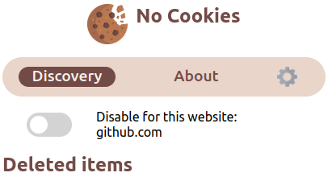

# noCookies

## What is it ?

noCookies is an extension for firefox browser who hide popup cookie.  

## Why ?

With the RGPD law in the European Union, all website must ask the user if he accept cookies.

As soon as you want to go to a website, you have popup windows to accept cookies.

After a while, **it's get annoying**.

I know that several people have already made extensions (and better than me)

But I wanyed to learn how a web extension works.

I decided to create my own extension.

## How it works ?

1. Install the [extension](https://addons.mozilla.org/addon/nocookies/) from the mozilla extension store. 
2. Enjoy
3. You have the choice to desactivate or not the extension

# Useful links

[NoCookie Extension](https://addons.mozilla.org/addon/nocookies/)

[Mozilla developper](https://addons.mozilla.org/en-us/developers/)

[Mozilla Workshop](https://extensionworkshop.com/)
